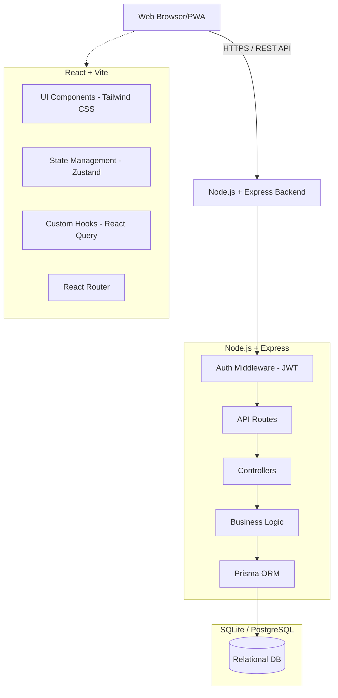
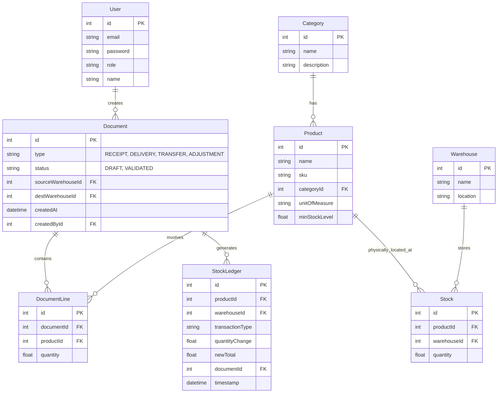

# CoreInventory - System Architecture & Design Document

## 1. System Architecture Diagram



## 2. Database Schema (Prisma ERD representation)



## 3. Backend API Design

**Authentication:**
- `POST /api/auth/register` - Create a new user
- `POST /api/auth/login` - Authenticate and return JWT
- `POST /api/auth/reset-password` - Request OTP for password reset

**Products:**
- `GET /api/products` - List products with optional category/SKU filters
- `POST /api/products` - Create new product
- `GET /api/products/:id` - Get product details (including live stock levels)
- `PUT /api/products/:id` - Update product
- `DELETE /api/products/:id` - Delete product

**Inventory Documents (Receipts, Deliveries, Transfers, Adjustments):**
- `GET /api/documents?type=RECEIPT,DELIVERY...` - List documents
- `POST /api/documents` - Create a new document (e.g., Transfer)
- `POST /api/documents/:id/validate` - Validate the document (Triggers the StockLedger and Stock updates)

**Analytics & Dashboard:**
- `GET /api/dashboard/kpis` - Get total products, low stock, pending receipts/deliveries
- `GET /api/dashboard/trends` - Get AI demand forecasting & inventory activity

## 4. Frontend Page Structure

- **`/login`**, **`/signup`**, **`/forgot-password`** - Authentication pages
- **`/` (Dashboard)** - Key KPIs, Low Stock Alerts, Charts, Activity Timeline
- **`/products`** - Product master list with quick-add functionality
- **`/products/:id`** - Detailed product view showing stock across warehouses and history
- **`/receipts`** - Incoming stock management
- **`/deliveries`** - Outgoing stock management
- **`/transfers`** - Internal stock movement
- **`/adjustments`** - Physical discrepancy adjustments
- **`/ledger`** - Complete trace of every stock movement
- **`/settings`** - User profile, Light/Dark mode toggles, Warehouse/Category management

## 5. UI Layout Description

The UI will be built as a modern, clean ERP application (similar to Odoo or Notion):
*   **Theme:** Minimalist SaaS styling, sleek Light & Dark mode toggle.
*   **Sidebar:** Fixed on the left, containing navigation links (Dashboard, Products, Receipts, Deliveries, Transfers, Ledger, Settings) with subtle hover animations.
*   **Top Bar:** Global search (Intelligent SKU/Name search), Notification bell (Stock alerts), User profile, and Theme toggle.
*   **Main Content Area:**
    *   **Cards:** Glassmorphism or clean soft-shadow cards for KPIs.
    *   **Tables:** Clean, sortable data tables with sticky headers, pagination, and inline status badges (e.g., specific colors for Draft vs Validated).
    *   **Forms:** Slide-out panels or sleek modals for creating items, ensuring the user doesn't lose their context on the main table.

## 6. Folder Structure

```text
CoreInventory/
├── backend/
│   ├── prisma/             # Database schema and migrations
│   ├── src/
│   │   ├── controllers/    # Route handlers
│   │   ├── middlewares/    # Auth, Validation, Error Handling
│   │   ├── routes/         # Express route definitions
│   │   ├── services/       # Core business logic (Stock adjustments, AI forecasts)
│   │   └── index.js        # Entry point
│   ├── .env
│   └── package.json
└── frontend/
    ├── src/
    │   ├── assets/         # Images, icons
    │   ├── components/     # Reusable UI (Buttons, Tables, Modals)
    │   ├── hooks/          # Custom React hooks (Theme, API fetchers)
    │   ├── layouts/        # Sidebar+Header wrappers
    │   ├── pages/          # Individual route pages (Dashboard, Products, etc.)
    │   ├── store/          # Zustand global state (Auth, UI state)
    │   └── App.jsx         # Router configuration
    ├── index.css           # Tailwind directives and custom variables
    ├── index.html
    └── tailwind.config.js  # Theme, fonts, color palettes
```

## 7. Example Code Snippet: Stock Validation Logic

When a document (e.g., Delivery or Transfer) is validated, it must atomically update `Stock` and insert into `StockLedger`:

```javascript
// backend/src/services/inventoryService.js
const validateDocument = async (documentId, userId) => {
    return await prisma.$transaction(async (tx) => {
        const doc = await tx.document.findUnique({
            where: { id: documentId },
            include: { lines: true }
        });

        if (doc.status === 'VALIDATED') throw new Error('Already validated');

        for (const line of doc.lines) {
            // Update source stock (Decrease)
            if (doc.type === 'DELIVERY' || doc.type === 'TRANSFER') {
                const stock = await tx.stock.upsert({
                    where: { productId_warehouseId: { productId: line.productId, warehouseId: doc.sourceWarehouseId } },
                    update: { quantity: { decrement: line.quantity } },
                    create: { productId: line.productId, warehouseId: doc.sourceWarehouseId, quantity: -line.quantity }
                });
                
                await tx.stockLedger.create({
                    data: {
                        productId: line.productId,
                        warehouseId: doc.sourceWarehouseId,
                        transactionType: doc.type,
                        quantityChange: -line.quantity,
                        newTotal: stock.quantity,
                        documentId: doc.id
                    }
                });
            }
            
            // Update destination stock (Increase)
            if (doc.type === 'RECEIPT' || doc.type === 'TRANSFER') {
                const stock = await tx.stock.upsert({
                    where: { productId_warehouseId: { productId: line.productId, warehouseId: doc.destWarehouseId } },
                    update: { quantity: { increment: line.quantity } },
                    create: { productId: line.productId, warehouseId: doc.destWarehouseId, quantity: line.quantity }
                });
                
                await tx.stockLedger.create({
                    data: {
                        productId: line.productId,
                        warehouseId: doc.destWarehouseId,
                        transactionType: doc.type,
                        quantityChange: line.quantity,
                        newTotal: stock.quantity,
                        documentId: doc.id
                    }
                });
            }
        }

        return await tx.document.update({
            where: { id: documentId },
            data: { status: 'VALIDATED' }
        });
    });
};
```

## 8. Step-by-Step Build Guide

1.  **Environment Setup**:
    *   Initialize `CoreInventory` directory.
    *   Set up React/Vite for Frontend and init Node.js Express for Backend.
2.  **Database & ORM**:
    *   Set up Prisma with SQLite (for fast local dev, smoothly transitioning to PostgreSQL for prod).
    *   Create `schema.prisma` with the unified models. Run migrations.
3.  **Backend Core API**:
    *   Implement user authentication (JWT).
    *   Build CRUD operations for Products, Categories, and Warehouses.
4.  **Inventory Logic Engine**:
    *   Build the advanced logic for Receipts, Deliveries, and Transfers inside a Transaction block to ensure the `StockLedger` and `Stock` are strictly tied to one another.
5.  **Frontend Layout & Auth**:
    *   Set up Tailwind, Dark mode class toggles, and Google Fonts (e.g., Inter).
    *   Build Login/Signup and Sidebar layout.
6.  **Frontend Views**:
    *   Develop the Dashboard with Charts and KPIs.
    *   Build the Products and Document pages with tables and slide-out panels.
7.  **Smart Features & Polish**:
    *   Integrate simple logic for AI-assisted demand forecasting (e.g., using linear regression or moving average on historical dispatch data).
    *   Refine UI animations and interactive alerts.
